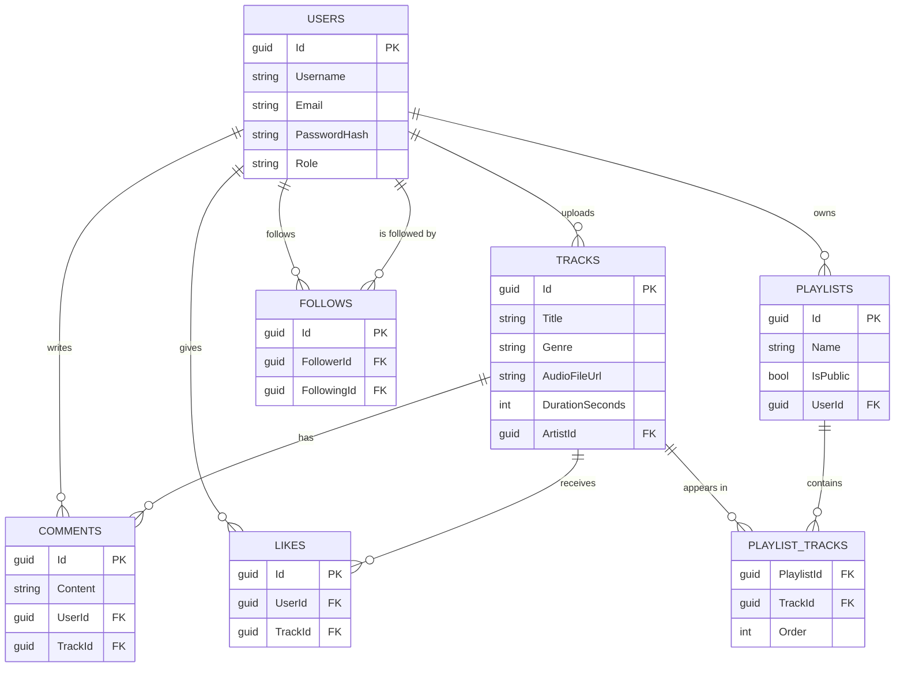

# 🎧 SoundCloud Clone API
> 🔗 Proyecto relacionado: [SoundCloud Clone Frontend](https://github.com/sevillanodev/soundcloud-clone-frontend) — cliente en React + TypeScript que consume esta API.

Backend Web API tipo SoundCloud construida en **.NET 8 (C#)** siguiendo **Clean Architecture**, con autenticación JWT, subida de archivos multimedia y **audio streaming real mediante Range Requests (HTTP 206 Partial Content)**.

Proyecto de portafolio desarrollado por [@sevillanodev](https://github.com/sevillanodev).

---

## 📌 Características principales

- **Clean Architecture** con 4 capas totalmente separadas (Domain, Application, Infrastructure, API)
- **Autenticación JWT** con hash de contraseñas mediante BCrypt
- **Autorización basada en roles** (`Listener` / `Artist`)
- **Audio streaming progresivo** con soporte de Range Requests (permite adelantar/retroceder sin descargar el archivo completo)
- **Subida de archivos multimedia** (audio `.mp3`/`.wav` y portadas `.jpg`/`.png`) validados por tipo y tamaño
- **Entity Framework Core** con SQL Server, mapeado 100% mediante Fluent API (`IEntityTypeConfiguration<T>`)
- **Interacciones sociales**: likes, seguir artistas, playlists, búsqueda por título/género/artista
- **Validaciones** con FluentValidation
- **Manejo global de excepciones** mediante middleware, con respuestas estandarizadas (`ApiResponse<T>`)
- **Documentación interactiva** con Swagger/OpenAPI, incluyendo soporte para JWT Bearer y `multipart/form-data`

---

## 🏗️ Arquitectura

El proyecto sigue estrictamente los principios de **Clean Architecture**, con una regla de dependencia unidireccional: las capas externas dependen de las internas, nunca al revés.

```
SoundCloudCloneApi/
├── src/
│   ├── SoundCloudCloneApi.Domain/          → Entidades, interfaces de repositorio, excepciones de dominio
│   ├── SoundCloudCloneApi.Application/     → DTOs, interfaces de servicios, lógica de negocio, validadores
│   ├── SoundCloudCloneApi.Infrastructure/  → DbContext, configuraciones EF Core, repositorios, servicios externos
│   └── SoundCloudCloneApi.API/             → Controllers, middlewares, JWT, Swagger, Program.cs
```

| Capa | Responsabilidad | Depende de |
|---|---|---|
| **Domain** | Entidades (`User`, `Track`, `Playlist`...), interfaces de repositorio, excepciones de dominio | Nada |
| **Application** | DTOs, interfaces de servicios, lógica de negocio, validaciones (FluentValidation) | Domain |
| **Infrastructure** | `ApplicationDbContext`, configuraciones Fluent API, repositorios, almacenamiento de archivos, JWT | Application |
| **API** | Controllers REST, middleware de excepciones, autenticación JWT, Swagger | Infrastructure, Application |

---

## 🗄️ Modelo de datos (Diagrama E-R)



> GitHub renderiza este diagrama automáticamente al ver el README en el repositorio.

---

## 🛠️ Stack tecnológico

| Categoría | Tecnología |
|---|---|
| Framework | .NET 8 (C#) |
| ORM | Entity Framework Core 8 |
| Base de datos | SQL Server (LocalDB para desarrollo) |
| Autenticación | JWT Bearer + BCrypt |
| Validación | FluentValidation |
| Documentación API | Swagger / Swashbuckle |
| Arquitectura | Clean Architecture (4 capas) |

---

## 🔑 Endpoints clave

### Autenticación
| Método | Ruta | Descripción | Auth |
|---|---|---|---|
| `POST` | `/api/Auth/register` | Registra un nuevo usuario (Listener o Artist) | No |
| `POST` | `/api/Auth/login` | Inicia sesión y devuelve un JWT | No |
| `GET` | `/api/Auth/me` | Devuelve los datos del usuario autenticado | Sí |

### Tracks
| Método | Ruta | Descripción | Auth |
|---|---|---|---|
| `GET` | `/api/Tracks` | Lista todos los tracks | No |
| `GET` | `/api/Tracks/search?query=&genre=&artist=` | Búsqueda por título, género o artista | No |
| `POST` | `/api/Tracks/upload` | Sube un track (`multipart/form-data`) | Sí (Artist) |
| `GET` | `/api/Tracks/{id}/stream` | Reproduce el audio con soporte de Range Requests | No |
| `POST` | `/api/Tracks/{id}/like` | Da o quita like a un track (toggle) | Sí |

### Playlists
| Método | Ruta | Descripción | Auth |
|---|---|---|---|
| `POST` | `/api/Playlists` | Crea una playlist | Sí |
| `GET` | `/api/Playlists/{id}` | Obtiene una playlist con sus tracks | No |
| `POST` | `/api/Playlists/{id}/tracks` | Agrega un track a la playlist | Sí |
| `DELETE` | `/api/Playlists/{id}/tracks/{trackId}` | Quita un track de la playlist | Sí |

### Usuarios
| Método | Ruta | Descripción | Auth |
|---|---|---|---|
| `POST` | `/api/Users/{id}/follow` | Sigue o deja de seguir a un artista (toggle) | Sí |
| `GET` | `/api/Users/{id}/followers` | Lista los seguidores de un usuario | No |
| `GET` | `/api/Users/{id}/following` | Lista a quién sigue un usuario | No |

---

## ▶️ Guía de ejecución

### Requisitos previos
- [.NET 8 SDK](https://dotnet.microsoft.com/en-us/download/dotnet/8.0)
- SQL Server LocalDB (incluido con Visual Studio) o una instancia de SQL Server

### Pasos

```bash
# 1. Clonar el repositorio
git clone https://github.com/sevillanodev/soundcloud-clone-api.git
cd soundcloud-clone-api

# 2. Restaurar dependencias
dotnet restore

# 3. Ajustar la cadena de conexión en src/SoundCloudCloneApi.API/appsettings.json
#    (por defecto usa LocalDB: Server=(localdb)\MSSQLLocalDB)

# 4. Aplicar las migraciones de EF Core
dotnet ef database update --project src/SoundCloudCloneApi.Infrastructure --startup-project src/SoundCloudCloneApi.API

# 5. Ejecutar la API
dotnet run --project src/SoundCloudCloneApi.API
```

La API quedará disponible en `https://localhost:7043`, con Swagger en `https://localhost:7043/swagger`.

### Autenticación en Swagger
1. Ejecuta `POST /api/Auth/register` o `/login` para obtener un token JWT.
2. Haz clic en **Authorize** (candado verde) e ingresa el token (Swagger agrega el prefijo `Bearer` automáticamente).
3. Ya puedes probar los endpoints protegidos.

---

## 📄 Licencia

Proyecto desarrollado con fines educativos y de portafolio.
